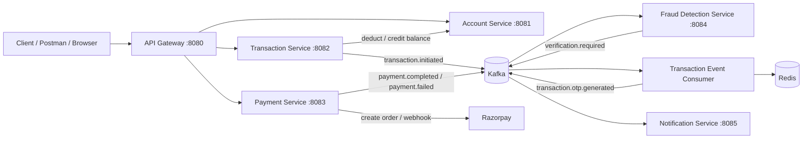

# Digital Banking System

A Spring Boot microservices-based digital banking platform that demonstrates real-world banking flows such as account management, money transfers, fraud checks, OTP verification, payment order creation, and event-driven notifications.

This project uses:
- Spring Boot 3 / Java 17
- Spring Cloud Gateway
- MySQL for persistence
- Redis for rate limiting and OTP storage
- Kafka for event-driven communication
- Feign clients for service-to-service calls
- Razorpay payment integration

---

## Table of Contents
- [Overview](#overview)
- [Architecture](#architecture)
- [Service Overview](#service-overview)
- [Project Structure](#project-structure)
- [Tech Stack](#tech-stack)
- [Prerequisites](#prerequisites)
- [Environment Configuration](#environment-configuration)
- [Running the Project](#running-the-project)
- [API Endpoints](#api-endpoints)
- [Example Requests](#example-requests)
- [Transaction / Fraud Flow](#transaction--fraud-flow)
- [Troubleshooting](#troubleshooting)

---

## Overview

The Digital Banking System is designed as a modular microservice application where each domain is isolated but coordinated through asynchronous messaging. It focuses on secure online banking behaviors rather than a full production-grade banking system.

The system includes:
- Account creation and lookup
- Balance management and account blocking
- Internal money transfers with SAGA-style compensation
- Suspicious transaction detection
- OTP-based validation for risky transfers
- Notifications via Kafka consumers
- Razorpay payment order generation and webhook processing
- Gateway-based routing and rate limiting

---

## Architecture



### Core design principles
- Event-driven orchestration using Kafka
- SAGA compensation for failed/invalid transaction flows
- Redis-backed OTP validation and rate limiting
- Direct service communication for account balance checks via Feign
- Console-style notifications for banking alerts

---

## Service Overview

### 1) Account Service
Location: `account-service`

Responsibilities:
- Create and manage banking accounts
- Query account details and balances
- Deduct or credit funds
- Block suspicious or compromised accounts
- Consume Kafka events like transaction completion and fraud detection

Port: `8081`

Primary endpoints:
- `POST /api/v1/accounts`
- `GET /api/v1/accounts/{accountNumber}`
- `GET /api/v1/accounts/{accountNumber}/balance`
- `PUT /api/v1/accounts/{accountNumber}/block`
- `PUT /api/v1/accounts/{accountNumber}/deduct?amount=...`
- `PUT /api/v1/accounts/{accountNumber}/credit?amount=...`

### 2) Transaction Service
Location: `transaction-service`

Responsibilities:
- Handle money transfers between accounts
- Trigger the fraud-check pipeline
- Generate and validate OTP for high-risk transactions
- Publish transaction lifecycle events to Kafka
- Compensate transactions when needed

Port: `8082`

Primary endpoints:
- `POST /api/v1/transactions/transfer`
- `GET /api/v1/transactions/{transactionId}`
- `GET /api/v1/transactions/account/{accountNumber}`
- `POST /api/v1/transactions/{transactionId}/verify?otp=...`

### 3) Fraud Detection Service
Location: `fraud-detection-service`

Responsibilities:
- Evaluate suspicious activity rules
- Detect velocity abuse, unusual large transfers, and risky balance consumption
- Trigger OTP verification or flag accounts

Port: `8084`

Rules implemented:
- Maximum transactions per minute
- Amount threshold based on historical average
- Transfer exceeding a percentage of current balance

### 4) Notification Service
Location: `notification-service`

Responsibilities:
- Subscribe to Kafka topics and log alerts
- Simulate notifications for transaction completions, refunds, OTP verification, and payment outcomes

Port: `8085`

### 5) Payment Service
Location: `payment-service`

Responsibilities:
- Create Razorpay payment orders
- Process Razorpay webhook events
- Publish payment success/failure alerts to Kafka

Port: `8083`

Primary endpoints:
- `POST /api/v1/payments/create-order`
- `POST /api/v1/payments/webhook`

### 6) API Gateway
Location: `api-gateway`

Responsibilities:
- Route external traffic to internal services
- Enforce request rate limiting using Redis
- Expose a single entry point

Port: `8080`

Routes:
- `/api/v1/accounts/**`
- `/api/v1/transactions/**`
- `/api/v1/payments/**`

---

## Project Structure

```text
Digital-Banking-System/
├── .env
├── docker-compose.yml
├── README.md
├── account-service/
│   ├── Dockerfile
│   ├── pom.xml
│   └── src/
├── transaction-service/
│   ├── Dockerfile
│   ├── pom.xml
│   └── src/
├── payment-service/
│   ├── Dockerfile
│   ├── pom.xml
│   └── src/
├── fraud-detection-service/
│   ├── Dockerfile
│   ├── pom.xml
│   └── src/
├── notification-service/
│   ├── Dockerfile
│   ├── pom.xml
│   └── src/
├── api-gateway/
│   ├── Dockerfile
│   ├── pom.xml
│   └── src/
└── .gitignore
```

---

## Tech Stack

- Java 17
- Spring Boot 3
- Maven
- MySQL 8
- Redis
- Apache Kafka
- Spring Cloud Gateway
- OpenFeign
- Lombok
- Jakarta Validation
- Razorpay SDK

---

## Prerequisites

Before running the system, install:
- Java 17+
- Maven 3.9+
- Docker and Docker Compose
- MySQL client (optional for manual inspection)
- Redis client (optional)

---

## Environment Configuration

The project uses a root `.env` file for local environment values.

Example:

```env
MYSQL_ROOT_PASSWORD=root
RAZORPAY_KEY_ID=YOUR_KEY_ID
RAZORPAY_KEY_SECRET=YOUR_KEY_SECRET
```

The docker compose file expects these values and injects them into services.

> Note: the compose file uses image names like `YOUR_IMAGE/...:latest`, so it is intended for image-based deployment. For local development, launching each service with Maven is usually more practical.

---

## Running the Project

### Option 1: Run infrastructure via Docker Compose

From the project root:

```bash
docker compose up -d redis mysql zookeeper kafka
```

Then start each service separately with Maven using the relevant directories:

```bash
cd account-service && mvn spring-boot:run
cd transaction-service && mvn spring-boot:run
cd payment-service && mvn spring-boot:run
cd fraud-detection-service && mvn spring-boot:run
cd notification-service && mvn spring-boot:run
cd api-gateway && mvn spring-boot:run
```

### Option 2: Run everything with Maven in separate terminals

Open a new terminal for each service and run:

```bash
cd account-service && mvn spring-boot:run
cd transaction-service && mvn spring-boot:run
cd payment-service && mvn spring-boot:run
cd fraud-detection-service && mvn spring-boot:run
cd notification-service && mvn spring-boot:run
cd api-gateway && mvn spring-boot:run
```

### Service ports

| Service | Port |
| --- | --- |
| API Gateway | 8080 |
| Account Service | 8081 |
| Transaction Service | 8082 |
| Payment Service | 8083 |
| Fraud Detection | 8084 |
| Notification Service | 8085 |
| Redis | 6379 |
| MySQL | 3306 |
| Kafka | 9092 |

---

## API Endpoints

### Account API

#### Create account
```http
POST /api/v1/accounts
```

Request body:
```json
{
  "accountHolderName": "Alice Johnson",
  "email": "alice@example.com",
  "phone": "+1234567890",
  "accountType": "SAVINGS",
  "initialDeposit": 10000.00
}
```

#### Get account
```http
GET /api/v1/accounts/{accountNumber}
```

#### Get balance
```http
GET /api/v1/accounts/{accountNumber}/balance
```

#### Block account
```http
PUT /api/v1/accounts/{accountNumber}/block
```

### Transaction API

#### Transfer funds
```http
POST /api/v1/transactions/transfer
```

Request body:
```json
{
  "senderAccountNumber": "123456789012",
  "receiverAccountNumber": "987654321098",
  "amount": 500.00,
  "description": "Office reimbursement"
}
```

#### Get transaction
```http
GET /api/v1/transactions/{transactionId}
```

#### Get account transaction history
```http
GET /api/v1/transactions/account/{accountNumber}
```

#### Verify OTP
```http
POST /api/v1/transactions/{transactionId}/verify?otp=123456
```

### Payment API

#### Create Razorpay order
```http
POST /api/v1/payments/create-order
```

Request body:
```json
{
  "accountNumber": "123456789012",
  "amount": 2500.00,
  "description": "Course fee"
}
```

#### Razorpay webhook
```http
POST /api/v1/payments/webhook
```

---

## Example Requests

### 1) Create an account
```bash
curl -X POST http://localhost:8080/api/v1/accounts \
  -H "Content-Type: application/json" \
  -d '{
    "accountHolderName": "Alice Johnson",
    "email": "alice@example.com",
    "phone": "+1234567890",
    "accountType": "SAVINGS",
    "initialDeposit": 10000.00
  }'
```

### 2) Get account details
```bash
curl http://localhost:8080/api/v1/accounts/123456789012
```

### 3) Transfer money
```bash
curl -X POST http://localhost:8080/api/v1/transactions/transfer \
  -H "Content-Type: application/json" \
  -d '{
    "senderAccountNumber": "123456789012",
    "receiverAccountNumber": "987654321098",
    "amount": 500.00,
    "description": "Monthly transfer"
  }'
```

### 4) Verify OTP for a suspicious transfer
```bash
curl -X POST "http://localhost:8080/api/v1/transactions/{transactionId}/verify?otp=123456"
```

### 5) Create payment order
```bash
curl -X POST http://localhost:8080/api/v1/payments/create-order \
  -H "Content-Type: application/json" \
  -d '{
    "accountNumber": "123456789012",
    "amount": 2500.00,
    "description": "Subscription"
  }'
```

---

## Transaction / Fraud Flow

The project implements a practical fraud-aware transfer flow.

1. Client calls `POST /api/v1/transactions/transfer`
2. `TransactionService` immediately deducts the sender balance from the account service
3. The transaction record is saved as `PROCESSING`
4. A `transaction.initiated` event is published to Kafka
5. `FraudDetectionService` consumes the event and evaluates:
   - velocity check
   - unusual amount threshold
   - balance-to-transfer risk
6. If the transaction is considered suspicious:
   - a `verification.required` event is published
   - the transaction is set to `PENDING_VERIFICATION`
   - a 6-digit OTP is generated and stored in Redis for 5 minutes
   - notification service emits an alert
7. The client calls `POST /api/v1/transactions/{id}/verify?otp=...`
8. If OTP is valid:
   - the transaction is marked `COMPLETED`
   - a `transaction.completed` event is emitted
   - the receiver account is credited
   - success notifications are sent
9. If OTP expires or is wrong:
   - the transaction is compensated
   - funds are refunded to the sender
   - account may be blocked for security

This is a simplified SAGA-style execution pattern built with Kafka events and compensation logic.

---

## Notes on Real-World Behavior

This project is best understood as a demonstration platform or learning project rather than a production banking backend. Some design elements are intentionally simplified, including:
- notification sending is logged to the console rather than integrated with SMS/email providers
- payment events use Razorpay but must be configured with actual keys
- the database config is local and environment-specific
- internal services assume local network access through Docker or local Spring Boot startup

---

## Troubleshooting

### MySQL connection issues
Check that MySQL is running and the DB exists. The services use databases such as:
- `account_db`
- `transaction_db`
- `payment_db`

### Kafka connection issues
Ensure Zookeeper and Kafka are started before the Spring Boot services. The application config expects Kafka at `localhost:29092` for local runs and `kafka:29092` inside Docker networking.

### Redis-related errors
Redis is used for request rate limiting and OTP storage. Confirm Redis is running on port `6379`.

### Payment errors
Set valid Razorpay credentials in `.env` and ensure the webhook secret matches your Razorpay configuration.

### API Gateway does not route requests
Make sure the gateway service is started after the backend services, and confirm that the route definitions in `api-gateway` match the target service ports.

---

## Contributing

Feel free to extend this project with:
- email/SMS providers for notification delivery
- JWT-based authentication and authorization
- eKYC or onboarding modules
- real transaction auditing and reporting
- database migrations with Flyway or Liquibase
- docker-compose production profiles

---

## License

This project is provided as a learning and demonstration repository. Add your preferred license if you plan to reuse it commercially or in a team environment.
